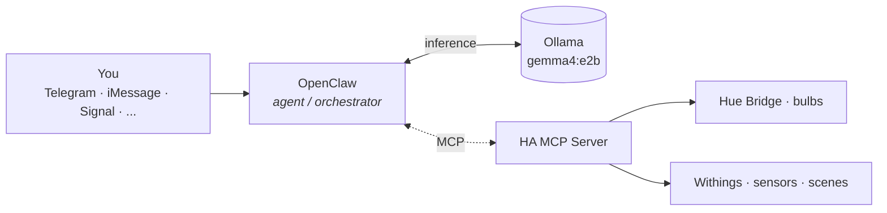

<p align="center">
  
</p>

# HAL

> Won't lock anyone out of any airlocks.

A private, locally-running home assistant.

## What this is

A repo for a smart-home setup whose brain — and eventually its voice — runs
entirely on local hardware. Stage one: [Home Assistant](https://www.home-assistant.io/).
Stage two, eventually: a locally-hosted LLM plugged into HA's *Assist* as the
conversation backend.

The home runs on Philips Hue + Apple Home today, with potential extras. HA is
being added as the automation brain. Apple Home stays primary.

## Layout

```
HAL/
├── home-assistant/   the HA stack
└── hal-assistant/    the LLM, when its phase arrives
```

Runtime data (HA's `config/`, secrets, future model files) lives outside the repo.

## Roadmap

- [x] Repo scaffold
- [x] HA running in Docker (on this Mac)
- [x] Hue + Withings wired in *(automations skipped — not interested)*
- [ ] Apple Home back-bridge *(deferred — needs a Linux host for mDNS)*
- [x] Local LLM via HA's Assist *(Ollama + `gemma4:e2b`, native on Mac)*
- [ ] **OpenClaw orchestration layer — next.** The agent that fans tool
  calls out to MCP servers (HA, later weather/calendar/etc.) and consults
  Ollama for inference. Lets HAL be talked to from Telegram, iMessage,
  Signal — not just from inside HA.
- [ ] Dedicated always-on hardware (Mac mini / Mac Studio)

## Phase 6 — what gets added, visually


